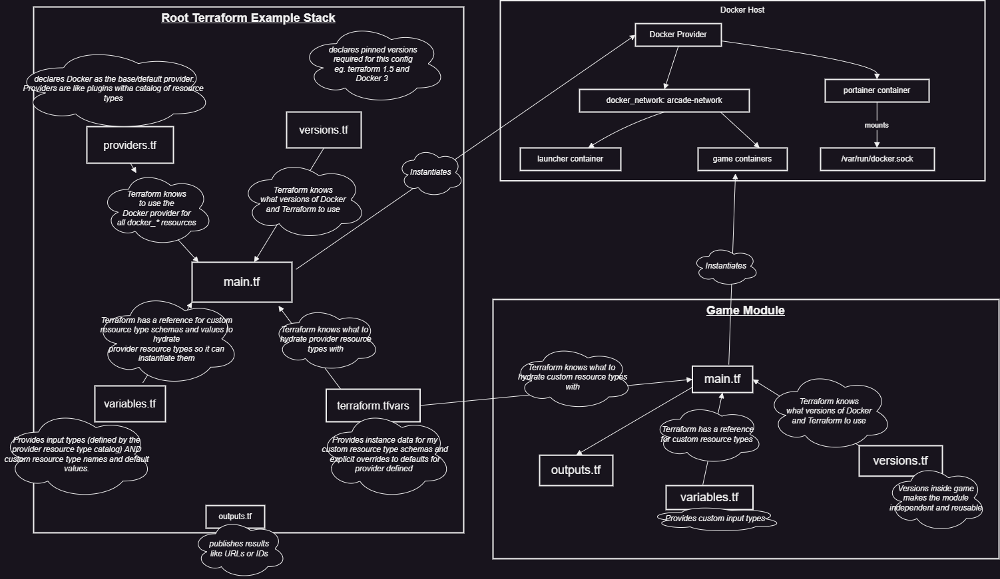

# 🕹️ Mini Arcade — Infrastructure as Fun



> Declarative retro gaming, powered by Terraform and Docker.

Spin up a fully containerised arcade cabinet with a single `terraform apply`.
Pulls and runs Tetris, plus a launcher page — all wired together as a mini internal platform.

---

## 🏗️ Stack

| Layer       | Technology              |
|-------------|-------------------------|
| Platform    | Docker                  |
| IaC         | Terraform               |
| Services    | Tetris, Nginx Launcher  |
| Networking  | Port mappings           |
| Storage     | Docker volumes          |

---

## 📦 Dependency Graph
```
docker_image.launcher        → docker_container.launcher
docker_image.game            → docker_container.game
docker_volume.arcade_data    → (used by future services)
```
Now with the docker_network

```
docker_network.arcade -> docker_container.launcher
docker_network.arcade -> module.games["tetris"].docker_container.this
docker_network.arcade -> module.games["mario"].docker_container.this
```


---

## 🏗️ Modular Design

This Terraform configuration follows a modular structure for better maintainability and reusability:

- **`variables.tf`**: Defines all input variables with descriptions and default values, making the stack easily configurable.
- **`providers.tf`**: Configures the Docker provider with required settings.
- **`versions.tf`**: Specifies minimum Terraform version and provider requirements.
- **`main.tf`**: Contains the core resource definitions (Docker images, containers, volumes).
- **`outputs.tf`**: Exposes output values like URLs for easy access.
- **`terraform.tfvars`** (optional): Allows overriding default variable values.

This separation of concerns allows you to:
- Customize ports, images, and names via variables
- Easily extend with new services
- Maintain clean, readable code

---

## 🎮 Dynamic Game Deployment with Foreach

This configuration leverages Terraform's `for_each` meta-argument to dynamically deploy multiple game containers using a reusable module. The `local.games` map defines each game's configuration, allowing easy addition of new games without duplicating code.

- **Module Reuse**: The `modules/game` module serves as a template for all game containers, ensuring consistency.
- **Scalability**: Adding a new game requires only updating the `local.games` map in `main.tf`.
- **Maintainability**: Changes to the game container logic are centralized in the module.

This approach demonstrates Terraform's power in managing infrastructure as code with loops and modules.

---

## 🌐 Docker Networking

This configuration creates a custom Docker network named `arcade-network` to enable secure inter-container communication. All game containers and the launcher are attached to this network, allowing them to communicate with each other using container names instead of IP addresses.

- **Isolation**: Containers on the custom network are isolated from the host's default bridge network, improving security.
- **Service Discovery**: Containers can reach each other via their names (e.g., `tetris`, `supermario`, `launcher`), simplifying internal networking.
- **Scalability**: As more services are added, they can easily join the same network for seamless integration.

The Portainer container remains on the default network to access the Docker socket for management purposes.

```docker network inspect arcade-network```

Shows that the 2 games are deployed inside the network, they form the application plane.
Portainer remains on then management plane.

---

## 🚀 Prerequisites

- [Terraform](https://developer.hashicorp.com/terraform/install)
- [Docker](https://docs.docker.com/get-docker/) (with dockerd / moby runtime)

---

## ▶️ Usage
```bash
terraform init
terraform apply
```

That's it. Your arcade is live.

---

## 🌐 Services & Ports

| Service   | URL                          |
|-----------|------------------------------|
| Launcher  | http://localhost:8080        |
| Tetris    | http://localhost:3001        |

---

## � Repository Layout

```
.
├── main.tf
├── providers.tf
├── versions.tf
├── variables.tf
├── outputs.tf
├── README.md
├── terraform.tfvars
├── .github/
│   └── workflows/
│       └── terraform-validate.yml
└── modules/
    └── game/
        ├── main.tf
        ├── outputs.tf
        ├── variables.tf
        └── versions.tf
```

## 🧠 Architecture

```
[Host Docker]
    |
    +-- [docker_network: arcade-network]
    |       +-- launcher
    |       +-- module.games["tetris"].docker_container.this
    |       +-- module.games["supermario"].docker_container.this
    |
    +-- [docker socket]
            +-- portainer
```

- The root stack deploys the launcher and Portainer plus a reusable game module.
- The `modules/game` module is the reusable building block for game containers.
- Portainer is on the Docker socket management plane, while the launcher/games are on the arcade application plane.

## ⚙️ Inputs

This repo uses the following Terraform inputs from `variables.tf`:

- `launcher_name`: Container name for the launcher
- `launcher_port`: External port for the launcher UI
- `launcher_image`: Docker image for the launcher
- `portainer_name`: Container name for Portainer
- `portainer_port`: External port for Portainer
- `portainer_image`: Docker image for Portainer
- `portainer_volume_name`: Volume name for Portainer data
- `games`: Map of game definitions

The default values and sample game definitions are in `terraform.tfvars`.

## 📤 Outputs

Current outputs exposed by the root module:

- `launcher_url`: URL for the arcade launcher
- `portainer_url`: URL for the Portainer UI

## ➕ How to add a new game

1. Open `terraform.tfvars`.
2. Add a new entry under the `games` map.
3. Provide the required fields:
   - `name`
   - `image`
   - `external_port`
   - `internal_port`
   - `title`
   - `description`
4. Run:

```bash
terraform init
terraform apply
```

This will create a new game container using the reusable `modules/game` module.

## ⚠️ Known limitations

- This is a demo/local setup, not a production-grade platform.
- State is stored locally in `terraform.tfstate`.
- Portainer is configured to mount the host Docker socket, which is convenient for demos but not secure for production.
- There is no remote backend configured, so state is not shared across machines.
- The game launcher and games are only exposed on localhost by default.

## ❓ Why Terraform instead of docker-compose?

This repo is designed to demonstrate infrastructure-as-code concepts, not just container orchestration.

- Terraform brings modularity with reusable modules.
- It supports declarative resource graphs and drift detection.
- It keeps container setup versioned alongside infrastructure configuration.
- It shows how infrastructure can be managed with variables, outputs, and reusable modules rather than a static compose file.

## 🗃️ State strategy

This is a local-state demo. Terraform state is stored locally in `terraform.tfstate` by default.

- Good for experimentation and learning.
- Not meant for shared or collaborative environments.
- If you want to move to a team-ready setup, add a remote backend such as S3, Azure Storage, or Terraform Cloud.

---

## �🔍 Drift Detection — The Cool Bit

Terraform's drift detection ensures your infrastructure stays in sync with your configuration.

Try this:
1. **Manually delete the Tetris container** (e.g., via Docker Desktop or Rancher Desktop UI)
2. Run `terraform plan` in this repo
3. Terraform will detect that Tetris is missing — that's **drift detection** in action
4. Run `terraform apply` and Terraform will recreate **only** the Tetris container

This is declarative infrastructure: you describe what should exist, and Terraform makes it so.

---

## 🧪 Manual Test Commands

<details>
<summary>Click to expand</summary>
```bash
# Tetris
docker run --rm -d -p 3001:80 --name tetris-test bsord/tetris

# Launcher (Nginx with custom HTML)
docker run -d -p 8080:80 --name launcher-test nginx:latest

# Force remove a container by ID
docker rm -f <container-id>
```

</details>